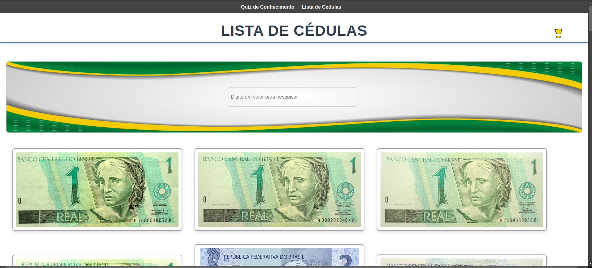

# Semana da Independência do Brasil 🇧🇷

Clique aqui para acessar o quiz
interativo: [Cédulas Brasileiras](https://marcoaurelior.github.io/cedulas-brasileiras/index.html)

Este arquivo foi criado em comemoração à **Semana da Independência do Brasil**. A **história das cédulas do Brasil** e
um **quiz interativo** para testar o seu conhecimento!

## 🏦 História das Cédulas no Brasil

## 🎯 Quiz: Em que Ano?

Agora que você já conhece um pouco da história das cédulas brasileiras, é hora de testar seus conhecimentos! Tente
adivinhar o **ano exato** em que cada uma das moedas foi introduzida no Brasil.

Faça pontos e se divirta. Boa sorte!